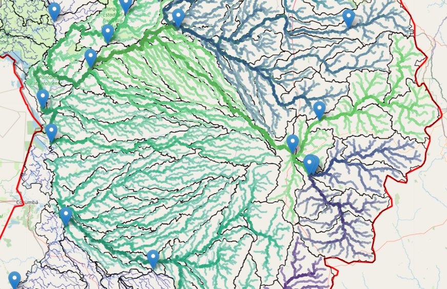

# SNIRH Water Station Distribution

[](https://www.python.org/downloads/)
[](https://www.gnu.org/licenses/gpl-3.0)



Tools to retrieve telemetering water station data from HidroWEB-ANA, retrieve DEM and compute sub-catchments and river network for a target sub-basin, compute river network as a graph structure with upstream sub-graphs related to water stations, and analyze water monitoring station distribution.

## 📋 Table of Contents

- [Overview](#overview)
- [Features](#features)
- [Installation](#installation)
- [Configuration](#configuration)
- [Quick Start](#quick-start)
- [Module Documentation](#module-documentation)
- [Data Availability](#data-availability)
- [Project Structure](#project-structure)
- [Requirements](#requirements)
- [Contributing](#contributing)
- [License](#license)
- [Contact](#contact)

## 🌊 Overview

This library provides automated access to Brazil's National Water Resources Information System (SNIRH) from the National Water Agency (ANA). While the system can be explored through [HidroWeb's web interface](https://www.snirh.gov.br/hidroweb/mapa), retrieving data for many stations at once is not implemented in the end-user interface. This library automates bulk data retrieval through API access.

The toolkit combines hydrological data retrieval with geospatial processing to:
- Download telemetric station data and river discharge time series
- Process Digital Elevation Models (DEMs) to delineate catchments
- Build river network graphs with flow direction and Strahler order
- Analyze monitoring station distribution and upstream influence zones

## ✨ Features

### Hydrological Data Retrieval
- **Automated API Access**: Authenticate and retrieve data from ANA's HidroWeb API
- **Station Inventory**: Get all telemetric stations for Brazilian sub-basins
- **Flow Series Data**: Download river discharge time series for multiple stations
- **Data Filtering**: Automatically filter and validate flow series data

### Catchment Processing
- **DEM Retrieval**: Download elevation data from OpenTopography API
- **Catchment Delineation**: Compute sub-basins using flow direction analysis
- **Stream Network Extraction**: Generate river networks with Strahler ordering
- **Station Snapping**: Align monitoring stations to river networks

### River Network Analysis
- **Graph Construction**: Build directed graphs from river geometries
- **Flow Direction Correction**: Automatically orient streams by Strahler order
- **Upstream Analysis**: Extract complete upstream networks for any station
- **Influence Zones**: Compute station monitoring influence areas
- **Network Statistics**: Calculate comprehensive network topology metrics

## 🚀 Installation

### From Source

```bash
# Clone the repository
git clone https://github.com/fhrochaf/SNIRH-Water-Station-Distribution.git
cd SNIRH-Water-Station-Distribution

### Dependencies

The package will automatically install required dependencies including:
- `geopandas` - Geospatial data handling
- `rasterio` / `rioxarray` - Raster processing
- `pyflwdir` - Flow direction analysis
- `networkx` - Graph analysis
- `folium` - Interactive mapping
- `requests` - API communication
- `python-dotenv` - Environment configuration

See `requirements.txt` for the complete list.

## ⚙️ Configuration

### API Credentials

Create a `config.env` file in the `/src` directory:

```env
# HidroWeb API Credentials
ID_SNIRH=your_snirh_id
PWD_SNIRH=your_snirh_password

# OpenTopography API Key
KEY_OPEN_TOPOGRAPHY=your_opentopography_key
```

### Obtaining Credentials

#### HidroWeb API Access

Registration for API access requires contacting ANA administration:

1. Send an email to **hidro@ana.gov.br**
2. Subject: `[Your CPF or CNPJ] - Request for access to the HidroWebService API for data consumption`
3. Wait for credentials to be provided

**Documentation**: [HidroWebService Manual](https://www.gov.br/ana/pt-br/assuntos/monitoramento-e-eventos-criticos/monitoramento-hidrologico/orientacoes-manuais/manuais/manual-hidrowebservice_publica.pdf)

#### OpenTopography API Key

Request an API key at: https://portal.opentopography.org/login?redirect=%2FrequestService%3Fservice%3Dapi

**Note**: OpenTopography services are sometimes unavailable or data may not be suitable for all regions.

## 🏁 Quick Start

```python
from src import *

# Load Brazilian sub-basins
gdf_subbasins = load_subbasins()

# Get access token for HidroWeb API
token = get_access_token(headers)

# Select a target sub-basin interactively
gdf_subbasin, ID_SUBBASIN = choose_subbasin(SUB_BASINS_PATH)

# Retrieve telemetric stations for the sub-basin
gdf_stations = get_telemstat_subbasin(token, ID_SUBBASIN)

# Get flow series data for all stations
flow_data = get_telemstat_flowseries_all(
    token, 
    gdf_stations, 
    start_date='2025-01-01', 
    end_date='2025-12-01'
)

# Filter successful responses and merge with geometries
gdf_flow_stations = filter_and_save_successfull_flowseries(
    flow_data, 
    gdf_stations
)

# Retrieve DEM for the sub-basin
dem = get_dem(
    gdf_subbasin, 
    KEY_OPEN_TOPOGRAPHY
)

# Delineate catchments and extract stream network
gdf_catchments, gdf_streams = pyflwdir_subbasins_minarea(
    dem,
    gdf_subbasin
)

# Snap stations to the stream network
gdf_stations_snapped = snap_stations_stream(gdf_flow_stations, gdf_streams)

# Create river network class
river_net = RiverNetwork(gdf_streams, gdf_stations_snapped)
# Split streams at stations
streams_split = river_net.split_streams_by_stations()
# Create river network graph
river_net.create_graph(direction='downstream', fix_direction=True)

# Get network statistics
stats = river_net.get_network_stats()
print(stats)

# List all station IDs
station_ids = river_net.list_all_station_ids()
print(station_ids)

# Get all station nodes
station_nodes = river_net.get_station_nodes()
for node, station_id in station_nodes.items():
    print(f"  Node {node}: Station {station_id}")


# Analyze upstream network for a specific station
station_id = gdf_stations_snapped.iloc[0]['station_id']
upstream_graph = river_net.get_upstream_subgraph(station_id)
river_net.visualize_upstream_subgraph(station_id)

# Compute station influence zones
influence_zones = river_net.compute_station_influence_zones(distance_threshold=50000)
gdf_influence = river_net.get_station_influence_geodataframe()
```

## 📚 Module Documentation

### `hidrowebANA.py` - HidroWeb API Interface

| Function | Description |
|----------|-------------|
| `get_access_token()` | Authenticates against ANA's HidroWeb API and returns access token |
| `get_subbasins()` | Retrieves metadata for all hydrological sub-basins |
| `get_telemstat_subbasin()` | Fetches telemetric stations for a sub-basin and returns GeoDataFrame |
| `get_telemstat_flowseries()` | Retrieves discharge time series for a single station |
| `get_telemstat_flowseries_all()` | Loops over stations and retrieves all flow series data |
| `filter_and_save_successfull_flowseries()` | Filters valid flow data and merges with station geometries |

### `catchments_processing.py` - DEM & Catchment Analysis

| Function | Description |
|----------|-------------|
| `get_dem()` | Retrieves DEM for bounding box using OpenTopography API |
| `_load_from_opentopo()` | Downloads and reprojects SRTM data from OpenTopography |
| `vectorize()` | Converts raster array to vector polygons |
| `pyflwdir_subbasins_minarea()` | Delineates catchments and stream networks from DEM |
| `snap_stations_poly()` | Snaps point locations to nearest polygon geometry |
| `snap_stations_stream()` | Snaps stations to nearest stream segment |
| `connect_streams()` | Merges connected stream segments into continuous lines |

### `river_network.py` - River Network Graph Analysis

#### `RiverNetwork` Class

Encapsulates river network analysis by combining stream geometries and monitoring stations into a directed graph. Supports network splitting, flow direction correction, upstream analysis, and station influence zoning.

| Method | Description |
|--------|-------------|
| `__init__()` | Initializes network with streams, stations, and Strahler order |
| `split_streams_by_stations()` | Splits river segments at station locations |
| `fix_river_direction()` | Orients segments by Strahler order (low → high) |
| `create_graph()` | Builds directed graph from river network |
| `get_network_stats()` | Computes summary statistics for topology |
| `get_station_nodes()` | Extracts graph nodes representing stations |
| `list_all_station_ids()` | Lists all unique station IDs in network |
| `graph_to_geodataframe()` | Converts graph edges to GeoDataFrame |
| `_add_cumulative_length()` | Computes cumulative river length via BFS |
| `get_upstream_subgraph()` | Extracts complete upstream network for station |
| `visualize_upstream_subgraph()` | Plots upstream network with NetworkX |
| `get_upstream_geodataframe()` | Converts upstream subgraph to GeoDataFrame |
| `compute_station_influence_zones()` | Determines upstream segments influenced by each station |
| `get_station_influence_geodataframe()` | Exports influence zones as GeoDataFrame |

## 💾 Data Availability

### Pre-downloaded Data (No Credentials Required)

If you cannot obtain API credentials, pre-processed data is available:

#### Station Inventory & Flow Series
📁 [Google Drive - Station Data](https://drive.google.com/drive/folders/1J7Hz45cXuulkpahaD_JpVK_oGygqmJvg?usp=drive_link)

Contains:
- Station inventories from `get_telemstat_subbasin()`
- Flow series data from `get_telemstat_flowseries_all()` 
- Filtered results from `filter_and_save_successfull_flowseries()`

**Usage**: Files are named with two-digit sub-basin IDs (e.g., `42_stations.geojson`). Select a matching sub-basin using `choose_subbasin()`.

#### Digital Elevation Models (DEMs)
📁 [Google Drive - DEM Data](https://drive.google.com/drive/folders/1c_NcoKtEFZkNS9EsjcDbT4IeXCWQCbMT?usp=drive_link)

Contains SRTM DEMs for all Brazilian sub-basins, projected to EPSG:3857.

**Note**: If OpenTopography API is unavailable or unsuitable, download the appropriate DEM for your target sub-basin. Use `prepare_raster()` if reprojection/resizing is needed.

## 📂 Project Structure

```
SNIRH-Water-Station-Distribution/
├── src/
│   ├── __init__.py              # Package initialization and imports
│   ├── config.env               # API credentials (create this)
│   ├── utils.py                 # Utility functions
│   ├── data/
│   │   └── hidrosubbasins.geojson  # Brazilian sub-basins geometries
│   ├── hidroweb/
│   │   └── hidrowebANA.py       # HidroWeb API functions
│   ├── catchments/
│   │   ├── catchments_processing.py  # DEM and catchment processing
│   │   └── river_network.py     # River network graph analysis
│   ├── outputs/                 # Generated outputs (created automatically)
├── setup.py                     # Package installation configuration
├── requirements.txt             # Python dependencies
└── README.md                    # This file
```

## 📦 Requirements

### Python Version
- Python 3.13+

### Core Dependencies
```
geopandas
rasterio
rioxarray
pyflwdir
networkx
folium
requests
python-dotenv
matplotlib
seaborn
numpy
pandas
shapely
```

See `requirements.txt` for complete list with version specifications.

## 🤝 Contributing

Contributions are welcome! Please feel free to submit a Pull Request.

1. Fork the repository
2. Create your feature branch (`git checkout -b feature/AmazingFeature`)
3. Commit your changes (`git commit -m 'Add some AmazingFeature'`)
4. Push to the branch (`git push origin feature/AmazingFeature`)
5. Open a Pull Request

## 📄 License

This project is licensed under the GNU Affero General Public License v3 - see the [LICENSE](LICENSE) file for details.

## 👥 Authors

- **Flavio Henrique da Rocha Fonseca** - [fhrochaf@gmail.com](mailto:fhrochaf@gmail.com)
- **Avinash Dhiran** - [dhiranavinash@gmail.com](mailto:dhiranavinash@gmail.com)

## 📧 Contact

For questions, issues, or contributions, please:
- Open an issue on [GitHub](https://github.com/fhrochaf/SNIRH-Water-Station-Distribution/issues)
- Contact the authors via email

## 🔗 Related Resources

- [SNIRH HidroWeb Portal](https://www.snirh.gov.br/hidroweb/mapa)
- [ANA (National Water Agency)](https://www.ana.gov.br/)
- [HidroWeb API Documentation](https://www.ana.gov.br/hidrowebservice/swagger-ui.html)
- [OpenTopography](https://portal.opentopography.org/)

## 🏷️ Keywords

`telemetering` `water stations` `hydrology` `monitoring` `Hydroweb` `SNIRH` `Brazilian basins` `river network` `catchment analysis` `DEM processing` `flow direction` `GIS`

---

**Note**: This library is designed to run in Python Notebooks or web environments due to the usage of Folium maps for interactive data visualization and selection.